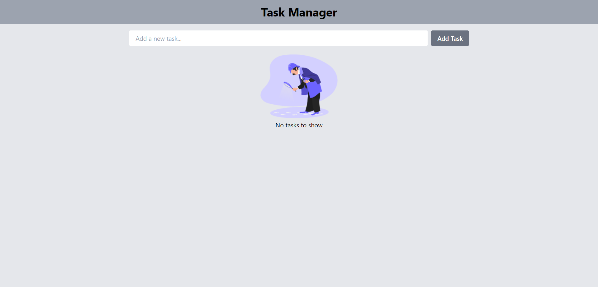
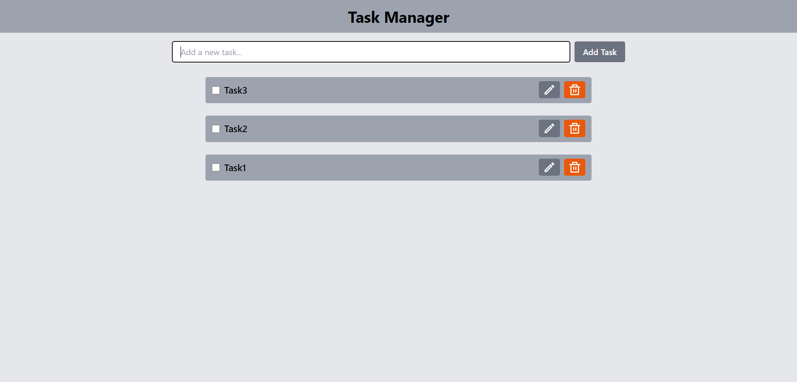
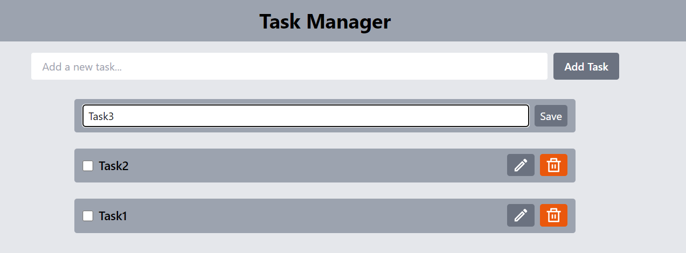

# Todo List App with React and Redux Toolkit

This is a simple Todo List application built using React and Redux Toolkit. Users can create tasks, edit tasks, mark tasks as done, and delete tasks.

## Live Link

Visit the application [here](https://todoappabhinav.netlify.app).

## Table of Contents

- [Features](#features)
- [Technologies Used](#technologies-used)
- [Visual Appearance](#visual-appearance)
- [How to Use](#how-to-use)
- [Setup Instructions](#setup-instructions)
- [Contributors](#contributors)
- [License](#license)

## Features

- **Create Task**: Users can add a new task using the input field provided.
- **Edit Task**: Each task has an edit option that allows users to modify the tasks.
- **Mark as Done**: Users can mark tasks as done by clicking on checkbox given.
- **Delete Task**: Users can delete tasks by clicking on the delete button.
- **Persistent Storage**: Tasks are stored in local storage, ensuring they are retained even after refreshing the page.
- **Responsive Design**: The application is responsive and works well on mobile, tablet, and desktop devices.

## Technologies Used

- **React**: A JavaScript library for building user interfaces.
- **Redux Toolkit**: A state management library that simplifies the process of managing the state in a React application.
- **Tailwind CSS**: A utility-first CSS framework for quickly building custom designs.

## Visual Appearance

## How to Use

1. **Adding a Task**: Type the task description in the input field and press Enter or click on the "Add Task" button.
2. **Editing a Task**: Click on the edit icon next to the task you want to edit, make changes in the input field, and press Enter or click on the save button.
3. **Marking as Done**: Click on the checkbox given to mark the task as done. Click again to undo.
4. **Deleting a Task**: Click on the delete button next to the task you want to remove from the list.

## Setup Instructions

To run the application locally, follow the steps below:

1. Clone the repository: `git clone <repository-url>`

2. Navigate to the project directory: `cd <project-directory>`

3. Install dependencies by runnig the command in terminal: `npm install`

4. Run the development server: `npm run dev`

5. Open the browser and visit `http://localhost:5173/` to view the application.

## Contributors
- Abhinav Singh

## License
This project is licensed under the [MIT License](LICENSE).